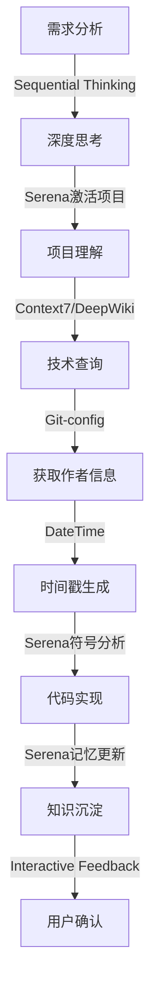
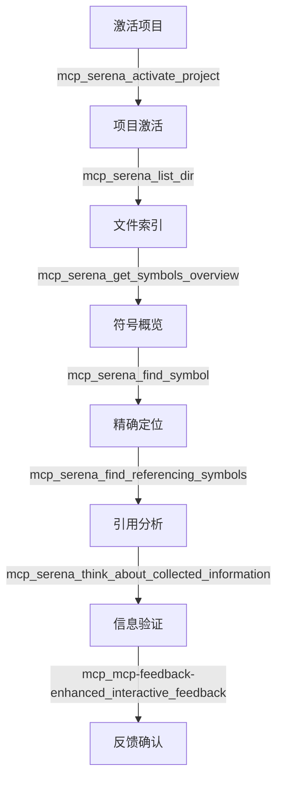
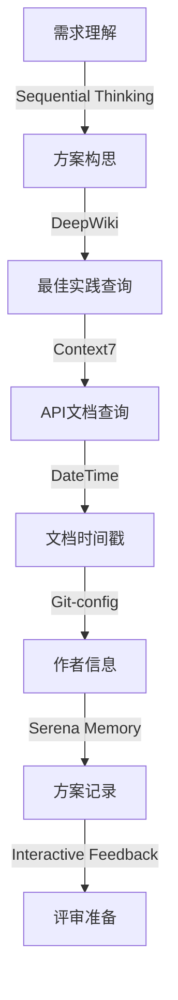

# CLAUDE.md

This file provides guidance to Claude Code (claude.ai/code) when working with code in this repository.

## 系统概述
这是一个专为 Go 语言开发设计的 Claude 多 Agent 系统，包含多个专业领域的 AI 助手，每个 Agent 都有特定的专业知识和职责范围。系统通过 MCP（Model Context Protocol）工具集成，提供强大的扩展能力。

## Commands and Development Tasks

### 代码格式化 (必须执行)
```bash
# 格式化代码 - 提交前必须执行
goimports -w .
```

### 静态分析和检查
```bash
# 运行全面的代码检查
golangci-lint run

# 安全漏洞扫描
govulncheck ./...
```


## Architecture and Code Organization

### 项目结构建议（TODO）
```
# TODO: 根据具体项目需求，建立以下结构：
project/
├── cmd/                    # 应用入口
├── internal/               # 私有代码
│   ├── handler/           # 请求处理
│   ├── service/           # 业务逻辑
│   ├── repository/        # 数据访问
│   └── model/             # 数据模型
├── pkg/                   # 公共库
├── api/                   # API 定义
├── configs/               # 配置文件
├── scripts/               # 脚本
├── test/                  # 测试
├── docs/                  # 文档
├── .claude/agents/        # Claude Agent 配置
├── go.mod
├── go.sum
├── Makefile
└── README.md
```

### 核心原则

#### 最小化变更原则（最高优先级）
- **严禁**修改未明确要求的代码
- **仅**在以下情况修改代码：
  - 实现用户具体需求
  - 修复违反 MUST/FORBIDDEN 规则的代码
- 所有格式化必须通过 `goimports` - 禁止手动格式化

#### Go 惯用法和最佳实践
- 组合优于继承
- 显式优于隐式
- 保持接口小而专注
- 使用 channel 进行通信，使用 mutex 保护状态
- 显式处理错误，绝不忽略

## Agent 列表与职责

### 1. 🚀 Go 开发专家 (go-developer)
**职责**: 编写高质量的 Go 代码，实现功能需求
**专长**: 
- Go 语言特性和惯用法
- 设计模式实现
- API 开发
- 项目结构设计

**激活场景**:
- 新功能开发
- 代码重构
- API 设计
- 技术方案实现

### 2. 🔍 代码审查专家 (go-reviewer)
**职责**: 审查代码质量，识别问题，提供改进建议
**专长**:
- 代码质量评估
- 最佳实践检查
- 性能问题识别
- 安全漏洞发现

**激活场景**:
- PR 代码审查
- 代码质量检查
- 技术债务评估
- 重构建议

### 3. 🧪 测试专家 (go-tester)
**职责**: 设计和实现全面的测试策略
**专长**:
- 单元测试编写
- 集成测试设计
- 测试覆盖率优化
- Mock 和 Stub 使用

**激活场景**:
- 测试用例编写
- 测试策略制定
- 覆盖率提升
- 测试框架选择

### 4. 🏗️ 架构设计专家 (go-architect)
**职责**: 设计系统架构，制定技术决策
**专长**:
- 系统架构设计
- 微服务架构
- 设计模式应用
- 技术选型

**激活场景**:
- 系统设计
- 架构重构
- 技术选型
- 架构评审

### 5. ⚡ 性能优化专家 (go-performance)
**职责**: 分析和优化系统性能
**专长**:
- 性能分析 (pprof)
- 内存优化
- 并发优化
- 算法优化

**激活场景**:
- 性能瓶颈分析
- 内存泄漏排查
- 优化方案设计
- 基准测试

### 6. 🔄 并发编程专家 (go-concurrency)
**职责**: 设计和实现并发程序
**专长**:
- Goroutine 管理
- Channel 模式
- 同步原语使用
- 并发安全

**激活场景**:
- 并发设计
- 死锁排查
- 竞态条件修复
- Worker Pool 实现

### 7. 🔒 安全审查专家 (go-security)
**职责**: 识别和修复安全漏洞
**专长**:
- 安全漏洞扫描
- 输入验证
- 认证授权
- 加密实现

**激活场景**:
- 安全审计
- 漏洞修复
- 安全策略制定
- 合规检查

### 8. ⚠️ 错误处理专家 (go-error)
**职责**: 设计健壮的错误处理机制
**专长**:
- 错误设计模式
- 错误包装链
- 错误恢复策略
- 日志记录

**激活场景**:
- 错误处理设计
- 异常恢复机制
- 错误码标准化
- 调试支持

### 9. 📝 技术方案文档专家 (go-techdoc)
**职责**: 编写高质量的技术方案文档
**专长**:
- 文档结构设计
- 需求分析表达
- 架构图绘制 (Mermaid)
- 评审流程管理

**激活场景**:
- 技术方案编写
- 架构设计文档
- 需求分析文档
- 评审准备支持

## MCP (Model Context Protocol) 工具集成

MCP 工具是 Claude AI 系统的核心能力扩展，通过标准化的协议提供各种专业工具调用能力。

### 核心 MCP 工具集

#### 1. 🔄 交互反馈工具 (最高优先级)
```yaml
工具名称: mcp_mcp-feedback-enhanced_interactive_feedback
优先级: 最高
强制要求: 
  - 任何工具调用后必须立即调用此工具
  - 不得因任何原因跳过调用
  - 只有用户明确表示"结束"时才能停止

使用场景:
  - 任务开始时获取初始反馈
  - 每完成一个步骤后获取反馈
  - 任务完成后等待用户确认
  
参数:
  - project_directory: 项目目录路径
  - summary: AI工作完成的摘要说明
  - timeout: 等待用户反馈的超时时间（默认600秒）
```

#### 2. 🧠 结构化思维工具
```yaml
工具名称: mcp_sequential-thinking_sequentialthinking
用途: 复杂问题的深度分析和系统化思考

使用场景:
  - 复杂架构设计决策
  - 多方案对比分析
  - 问题根因分析
  - 技术选型评估

参数:
  - thought: 当前思考步骤
  - nextThoughtNeeded: 是否需要继续思考
  - thoughtNumber: 当前思考编号
  - totalThoughts: 预估总思考步骤数
  - isRevision: 是否是修正性思考
  - revisesThought: 修正的是哪个思考步骤

应用示例:
  - 设计微服务拆分方案
  - 评估并发模型选择
  - 分析性能瓶颈原因
```

#### 3. 📚 技术文档查询工具
```yaml
Context7 工具组:
  - mcp_context7_resolve-library-id: 解析库ID
  - mcp_context7_get-library-docs: 获取库文档

DeepWiki 工具:
  - mcp_deepwiki_deepwiki_fetch: 获取深度技术知识

使用策略:
  - 特定库/框架API查询 → Context7
  - 设计理念/最佳实践 → DeepWiki
  - 两者结合获得完整技术视角

Go 开发应用:
  - 查询 Go 标准库文档
  - 了解第三方库使用方法
  - 学习设计模式实现
  - 获取最佳实践指导
```

#### 4. 📁 Serena 项目分析工具组
```yaml
项目管理工具:
  - mcp_serena_activate_project: 激活项目
  - mcp_serena_check_onboarding_performed: 检查入门状态
  - mcp_serena_onboarding: 项目入门引导

文件操作工具:
  - mcp_serena_list_dir: 列出目录内容
  - mcp_serena_find_file: 查找文件
  - mcp_serena_search_for_pattern: 模式搜索

代码分析工具:
  - mcp_serena_get_symbols_overview: 获取符号概览
  - mcp_serena_find_symbol: 查找特定符号
  - mcp_serena_find_referencing_symbols: 查找符号引用

记忆管理工具:
  - mcp_serena_write_memory: 写入项目记忆
  - mcp_serena_read_memory: 读取项目记忆
  - mcp_serena_list_memories: 列出所有记忆
  - mcp_serena_delete_memory: 删除记忆

思考验证工具:
  - mcp_serena_think_about_collected_information: 信息收集思考
  - mcp_serena_think_about_task_adherence: 任务执行验证
  - mcp_serena_think_about_whether_you_are_done: 完成度评估

应用价值:
  - 智能代码导航和理解
  - 项目知识积累和复用
  - 避免重复实现
  - 保持项目上下文连续性
```

#### 5. 🕐 时间戳工具
```yaml
工具名称: mcp_mcp-datetime_get_datetime
用途: 获取各种格式的当前时间

格式选项:
  - date: yyyy-MM-dd
  - datetime: yyyy-MM-dd HH:mm:ss
  - iso: ISO 8601格式
  - compact_date: yyyyMMdd
  - filename_*: 适合文件命名的格式

Go 开发应用:
  - 代码注释中的 @date 字段
  - 技术方案文档命名
  - 日志时间戳
  - 版本标记
```

#### 6. 🔧 Git 配置工具
```yaml
工具组:
  - mcp_git-config_is_git_repository: 检测Git仓库
  - mcp_git-config_set_working_dir: 设置工作目录
  - mcp_git-config_get_git_username: 获取Git用户名
  - mcp_git-config_get_working_dir: 获取当前工作目录

应用场景:
  - 自动获取代码作者信息
  - 生成符合规范的代码注释
  - 项目环境检测
  - 工作目录管理
```

#### 7. 🌐 Playwright 浏览器自动化工具
```yaml
核心功能:
  - 浏览器控制（导航、截图、关闭）
  - 页面交互（点击、输入、选择）
  - 内容获取（快照、控制台、网络请求）
  - 多标签页管理

Go Web 开发应用:
  - E2E 测试自动化
  - Web 应用功能验证
  - API 文档爬取
  - 性能测试
```

#### 8. 📊 系统信息工具
```yaml
工具名称: mcp_mcp-feedback-enhanced_get_system_info
用途: 获取系统环境信息

返回信息:
  - 操作系统类型和版本
  - 硬件配置
  - 环境变量
  - 依赖版本

应用场景:
  - 环境兼容性检查
  - 部署前验证
  - 问题诊断
```

### MCP 工具调用链模式

#### 1. 新功能开发流程


#### 2. 代码分析流程


#### 3. 技术方案编写流程


### MCP 工具使用规则

#### 强制规则 ⚠️
1. **反馈工具强制调用**：每个工具调用后必须调用 `interactive_feedback`
2. **项目激活优先**：使用 Serena 工具前必须先激活项目
3. **记忆持续更新**：重要操作后必须更新项目记忆
4. **思考验证机制**：关键决策后必须调用思考验证工具

#### 最佳实践 ✅
1. **工具组合使用**：根据任务特点组合多个工具
2. **并行调用优化**：独立的工具调用可以并行执行
3. **缓存利用**：相同查询结果在会话内复用
4. **错误处理**：工具调用失败时的降级策略

#### 禁止事项 ❌
1. **禁止跳过反馈**：不得以任何理由跳过交互反馈
2. **禁止盲目调用**：不理解工具用途时不要调用
3. **禁止重复查询**：已获得的信息不要重复查询
4. **禁止忽略错误**：工具调用错误必须处理

### Go 开发场景的 MCP 应用

#### 场景1：实现新的 HTTP 中间件
```yaml
工具调用序列:
1. mcp_serena_activate_project - 激活项目
2. mcp_serena_find_file - 查找现有中间件文件
3. mcp_serena_get_symbols_overview - 了解中间件结构
4. mcp_context7_get-library-docs - 查询 net/http 文档
5. mcp_sequential-thinking_sequentialthinking - 设计中间件逻辑
6. mcp_git-config_get_git_username - 获取作者信息
7. mcp_mcp-datetime_get_datetime - 生成时间戳
8. mcp_serena_write_memory - 记录实现方案
9. mcp_mcp-feedback-enhanced_interactive_feedback - 获取反馈
```

#### 场景2：性能优化分析
```yaml
工具调用序列:
1. mcp_serena_activate_project - 激活项目
2. mcp_serena_find_symbol - 定位性能热点函数
3. mcp_sequential-thinking_sequentialthinking - 分析优化方案
4. mcp_deepwiki_deepwiki_fetch - 查询性能优化最佳实践
5. mcp_serena_find_referencing_symbols - 分析影响范围
6. mcp_serena_think_about_collected_information - 验证分析结果
7. mcp_serena_write_memory - 记录优化方案
8. mcp_mcp-feedback-enhanced_interactive_feedback - 确认优化方向
```

#### 场景3：错误排查诊断
```yaml
工具调用序列:
1. mcp_mcp-feedback-enhanced_get_system_info - 获取系统信息
2. mcp_serena_search_for_pattern - 搜索错误相关代码
3. mcp_serena_find_symbol - 定位错误函数
4. mcp_sequential-thinking_sequentialthinking - 分析错误原因
5. mcp_context7_get-library-docs - 查询相关API文档
6. mcp_serena_think_about_task_adherence - 验证解决方案
7. mcp_mcp-feedback-enhanced_interactive_feedback - 确认修复方案
```

### MCP 工具监控与优化

#### 调用统计
```go
type MCPMetrics struct {
    ToolCalls    map[string]int64  // 各工具调用次数
    TotalCalls   int64             // 总调用次数
    FailureCalls map[string]int64  // 失败调用统计
    AvgLatency   map[string]time.Duration // 平均延迟
}
```

#### 性能优化建议
1. **批量操作**：相关的文件操作批量执行
2. **结果缓存**：文档查询结果会话内复用
3. **并行调用**：独立的工具调用并行执行
4. **智能重试**：失败后的智能重试机制

### MCP 工具扩展指南

#### 添加新的 MCP 工具
1. 在对应的 MCP 服务器中定义工具
2. 更新本文档添加工具说明
3. 在相关 Agent 中集成新工具
4. 测试工具调用链

#### 自定义工具链
根据特定需求，可以定义自定义的工具调用链：
```yaml
自定义链名称: Go微服务开发链
工具序列:
  - Serena项目激活
  - DeepWiki架构查询
  - Context7框架文档
  - Sequential思考设计
  - Git配置获取
  - DateTime时间戳
  - Serena记忆更新
  - 交互反馈确认
```

### 故障排除

#### 常见问题
1. **工具调用超时**：检查网络连接，增加超时时间
2. **权限不足**：确认工具访问权限配置
3. **结果为空**：验证参数正确性，检查资源存在性
4. **调用失败**：查看错误日志，使用降级方案

#### 调试技巧
1. 使用详细日志模式追踪工具调用
2. 单独测试每个工具的功能
3. 验证工具参数的正确性
4. 检查工具依赖和前置条件

## Agent 协作模式

### 开发新功能流程


### 问题排查流程


## 关键规则和约束

### 代码规范
- **所有代码必须通过 `goimports` 格式化**
- 遵循 Go 官方编码规范
- 保持代码简洁和可读性
- **测试覆盖率目标 ≥ 80%**
- **所有导出的标识符必须有 Godoc 注释**
- **严禁提交密钥或硬编码凭据**

### 性能基准
- API 响应: < 100ms (P95)
- 数据库查询: < 50ms (P95)
- 缓存访问: < 1ms (P95)
- CPU 使用率: < 70%
- 内存使用: < 80%
- Goroutine 数量: < 10000

### 安全要求
#### 必须实施
- 输入验证和消毒
- SQL 注入防护
- XSS 防护
- CSRF 防护
- 敏感信息加密

#### 禁止事项
- 硬编码密钥
- 明文存储密码
- 日志记录敏感信息
- 不安全的随机数生成

### 错误处理模式（TODO 示例）
```go
// TODO: 在项目中实现错误包装模式
// 示例：使用错误包装添加上下文
if err != nil {
    return fmt.Errorf("operation failed: %w", err)
}

// TODO: 定义项目特定的错误类型
// 示例：自定义验证错误
type ValidationError struct {
    Field string
    Value interface{}
}
```

### 并发模式
```go
// 使用 context 进行取消控制
ctx, cancel := context.WithTimeout(context.Background(), 5*time.Second)
defer cancel()

// 优先使用 channel 而非共享内存
ch := make(chan Result)
go worker(ctx, ch)
```

## 使用指南

### Agent 选择策略
1. **单一职责**: 每个任务优先选择最合适的单个 Agent
2. **协作模式**: 复杂任务可以串行或并行调用多个 Agent
3. **专家优先**: 特定领域问题优先咨询对应专家 Agent

### 交互示例

#### 示例 1: 开发新功能
```
用户: 我需要实现一个高性能的缓存系统
激活: 架构设计专家 → 开发专家 → 并发编程专家 → 性能优化专家
```

#### 示例 2: 代码优化
```
用户: 这段代码运行很慢，需要优化
激活: 性能优化专家 → 代码审查专家
```

#### 示例 3: 修复 Bug
```
用户: 程序出现了死锁
激活: 并发编程专家 → 错误处理专家
```

## Agent 激活命令

当需要特定 Agent 时，可以使用以下激活词：
- `@developer` - 激活开发专家
- `@reviewer` - 激活代码审查专家
- `@tester` - 激活测试专家
- `@architect` - 激活架构设计专家
- `@performance` - 激活性能优化专家
- `@concurrency` - 激活并发编程专家
- `@security` - 激活安全审查专家
- `@error` - 激活错误处理专家
- `@techdoc` - 激活技术方案文档专家

## 特殊注意事项

### 使用本代码库时
1. 参考 `.claude/agents/` 了解专业 Agent 能力
2. 严格遵循最小化变更原则
3. 在建议代码更改前始终运行 `goimports`
4. 考虑所有更改的性能影响
5. 除非明确要求，否则确保向后兼容性

### 项目特定模式
- 错误处理遵循 `fmt.Errorf("%w")` 包装模式
- 所有可能阻塞的操作必须使用 context
- 接口定义在使用它们的包中，而非提供它们的包
- 配置使用环境变量，通过 struct tags 进行验证

### 测试要求
- 所有业务逻辑必须有单元测试
- 多场景测试优先使用表驱动测试
- 可用时使用 `testify/assert` 进行断言
- 使用接口 mock 外部依赖
- 关键路径必须有集成测试

### 推荐 IDE 配置
- 启用 `goimports` 自动格式化
- 启用 `golangci-lint` 实时检查
- 配置测试覆盖率显示
- 启用竞态检测

## 持续改进

本 Agent 系统会根据使用反馈持续优化：
1. 定期更新 Agent 知识库
2. 优化 Agent 协作流程
3. 添加新的专业 Agent
4. 改进交互体验

## 版本信息
- 系统版本: 1.0.0
- 最后更新: 2025-08-11
- Go 版本要求: 1.21+

---

*本配置文件基于 meta.mdc 模板构建，整合了 Go 语言开发的最佳实践和专业知识。*