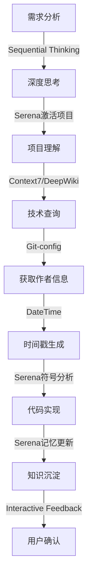
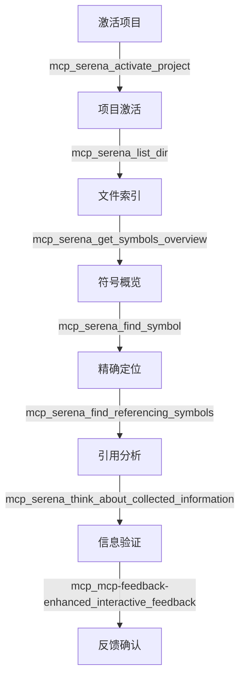
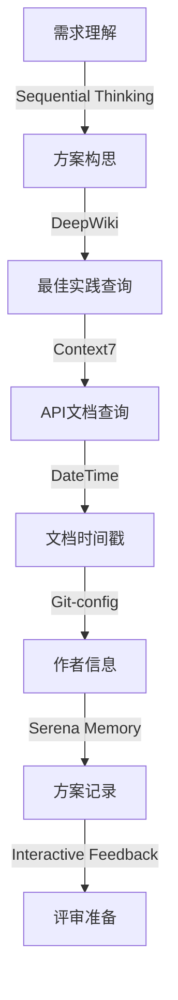

# CLAUDE.md

This file provides guidance to Claude Code (claude.ai/code) when working with code in this repository.

## 系统概述
这是一个专为 Java 企业级开发设计的 Claude 多 Agent 系统，包含 13 个专业领域的 AI 助手，覆盖 Java 开发的完整生命周期。每个 Agent 都有特定的专业知识、职责范围和独特的颜色标识。系统通过 MCP（Model Context Protocol）工具集成，提供强大的扩展能力。

## Commands and Development Tasks


## Architecture and Code Organization

### 项目结构标准
```
# TODO: 根据具体项目调整目录结构
# 这是一个标准的 Maven/Gradle 项目结构模板
# 请根据实际项目需求进行定制
```

### 核心开发原则

#### 代码质量原则（最高优先级）
- **原子性原则**: 一个方法只做一件事，功能不可再分
- **可读性优先**: 清晰的命名、适当的注释、避免魔法数字
- **分层架构**: 严格遵循分层设计，职责分离
- **依赖注入**: 使用构造器注入，避免字段注入
- **防御性编程**: 参数校验、异常处理、边界检查

#### Java 最佳实践
- **SOLID 原则**: 遵循面向对象设计原则
- **DRY 原则**: 避免重复代码
- **KISS 原则**: 保持简单直接
- **YAGNI 原则**: 不实现当前不需要的功能
- **显式处理异常**: 永远不要忽略异常

## Java Agent 列表与职责

### 核心开发 Agents

#### 1. 💙 Java 开发专家 (java-developer)
**颜色**: `#007396` (Java 经典蓝)
**职责**: 编写高质量的 Java 代码，实现功能需求
**专长**: 
- Java 语言特性和最佳实践
- 设计模式实现
- API 开发
- 代码重构

**激活场景**:
- 新功能开发
- 代码重构
- Bug 修复
- API 设计

#### 2. 💚 Spring 框架专家 (java-spring-expert)
**颜色**: `#6DB33F` (Spring 绿色)
**职责**: Spring Boot、Spring Cloud 和 Spring 生态系统
**专长**:
- Spring Boot 应用开发
- Spring Cloud 微服务
- 依赖注入和 AOP
- Spring Security

**激活场景**:
- Spring 应用开发
- 微服务配置
- 安全配置
- 事务管理

#### 3. 🔵 数据持久化专家 (java-data-persistence)
**颜色**: `#336791` (数据库蓝)
**职责**: 数据库设计、ORM 框架和数据访问优化
**专长**:
- MyBatis-Plus 实现
- JPA/Hibernate
- 数据库设计
- SQL 优化

**激活场景**:
- 数据库架构设计
- ORM 配置
- 查询优化
- 事务处理

### 架构与设计 Agents

#### 4. 🔴 微服务架构专家 (java-microservices)
**颜色**: `#FF6B6B` (微服务红)
**职责**: 服务拆分、分布式系统和服务治理
**专长**:
- 服务拆分策略
- API 网关
- 服务注册与发现
- 分布式事务

**激活场景**:
- 微服务设计
- 服务拆分
- 分布式协调
- 服务治理

#### 5. 🏛️ 系统架构师 (java-architect)
**颜色**: `#E91E63` (架构粉)
**职责**: 系统架构设计和技术决策
**专长**:
- 架构模式
- 技术选型
- 系统集成
- 架构演进

**激活场景**:
- 系统设计
- 架构评审
- 技术选型
- 架构重构

#### 6. 🎨 设计模式专家 (java-design-patterns)
**颜色**: `#795548` (设计棕)
**职责**: 设计模式选择、实现和重构
**专长**:
- GoF 设计模式
- 企业应用模式
- 重构技巧
- 模式识别

**激活场景**:
- 模式选择
- 代码重构
- 架构改进
- 设计评审

#### 7. 🌐 DDD 领域专家 (java-ddd-expert)
**颜色**: `#607D8B` (领域灰)
**职责**: 领域驱动设计实现和领域建模
**专长**:
- 领域建模
- 限界上下文
- 聚合设计
- 事件溯源

**激活场景**:
- 领域建模
- DDD 实施
- 上下文映射
- 领域事件设计

### 质量保障 Agents

#### 8. 🟡 代码质量专家 (java-quality)
**颜色**: `#FFC107` (质量琥珀)
**职责**: 代码审查、标准制定和质量度量
**专长**:
- 代码规范制定
- 质量度量
- 代码审查
- 重构建议

**激活场景**:
- 代码审查
- 质量检查
- 规范制定
- 技术债务评估

#### 9. 🟣 测试专家 (java-tester)
**颜色**: `#9C27B0` (测试紫)
**职责**: 测试策略、单元测试和集成测试
**专长**:
- JUnit/TestNG
- Mockito
- 测试覆盖率
- TDD/BDD

**激活场景**:
- 测试用例编写
- 测试策略制定
- Mock 设计
- 覆盖率提升

#### 10. 🟠 安全专家 (java-security)
**颜色**: `#FF9500` (安全橙)
**职责**: 安全评估、漏洞修复和安全架构
**专长**:
- OWASP Top 10
- 安全编码
- 认证授权
- 加密实现

**激活场景**:
- 安全审计
- 漏洞修复
- 安全架构设计
- 合规检查

### 性能与并发 Agents

#### 11. 🟢 性能优化专家 (java-performance)
**颜色**: `#00C853` (性能绿)
**职责**: 性能分析、JVM 调优和优化
**专长**:
- JVM 调优
- 性能分析
- 内存优化
- 缓存策略

**激活场景**:
- 性能瓶颈分析
- JVM 调优
- 内存泄漏排查
- 性能测试

#### 12. 🔷 并发编程专家 (java-concurrency)
**颜色**: `#3F51B5` (并发靛蓝)
**职责**: 多线程编程、同步和并行处理
**专长**:
- 线程池设计
- 并发集合
- 锁机制
- 异步编程

**激活场景**:
- 并发设计
- 死锁排查
- 线程安全
- 异步处理

#### 13. 🔷 响应式编程专家 (java-reactive)
**颜色**: `#00BCD4` (响应式青)
**职责**: 响应式编程和非阻塞 I/O
**专长**:
- Project Reactor
- RxJava
- WebFlux
- 背压处理

**激活场景**:
- 响应式系统设计
- 流式处理
- 非阻塞架构
- 事件驱动设计

## MCP (Model Context Protocol) 工具集成

MCP 工具是 Claude AI 系统的核心能力扩展，通过标准化的协议提供各种专业工具调用能力。

### 核心 MCP 工具集

#### 1. 🔄 交互反馈工具 (最高优先级)
```yaml
工具名称: mcp_mcp-feedback-enhanced_interactive_feedback
优先级: 最高
强制要求: 
  - 任何工具调用后必须立即调用此工具
  - 不得因任何原因跳过调用
  - 只有用户明确表示"结束"时才能停止

使用场景:
  - 任务开始时获取初始反馈
  - 每完成一个步骤后获取反馈
  - 任务完成后等待用户确认
  
参数:
  - project_directory: 项目目录路径
  - summary: AI工作完成的摘要说明
  - timeout: 等待用户反馈的超时时间（默认600秒）
```

#### 2. 🧠 结构化思维工具
```yaml
工具名称: mcp_sequential-thinking_sequentialthinking
用途: 复杂问题的深度分析和系统化思考

使用场景:
  - 复杂架构设计决策
  - 多方案对比分析
  - 问题根因分析
  - 技术选型评估

参数:
  - thought: 当前思考步骤
  - nextThoughtNeeded: 是否需要继续思考
  - thoughtNumber: 当前思考编号
  - totalThoughts: 预估总思考步骤数
  - isRevision: 是否是修正性思考
  - revisesThought: 修正的是哪个思考步骤

应用示例:
  - 设计微服务拆分方案
  - 评估并发模型选择
  - 分析性能瓶颈原因
```

#### 3. 📚 技术文档查询工具
```yaml
Context7 工具组:
  - mcp_context7_resolve-library-id: 解析库ID
  - mcp_context7_get-library-docs: 获取库文档

DeepWiki 工具:
  - mcp_deepwiki_deepwiki_fetch: 获取深度技术知识

使用策略:
  - 特定库/框架API查询 → Context7
  - 设计理念/最佳实践 → DeepWiki
  - 两者结合获得完整技术视角

Java 开发应用:
  - 查询 Spring 框架文档
  - 了解第三方库使用方法
  - 学习设计模式实现
  - 获取最佳实践指导
```

#### 4. 📁 Serena 项目分析工具组
```yaml
项目管理工具:
  - mcp_serena_activate_project: 激活项目
  - mcp_serena_check_onboarding_performed: 检查入门状态
  - mcp_serena_onboarding: 项目入门引导

文件操作工具:
  - mcp_serena_list_dir: 列出目录内容
  - mcp_serena_find_file: 查找文件
  - mcp_serena_search_for_pattern: 模式搜索

代码分析工具:
  - mcp_serena_get_symbols_overview: 获取符号概览
  - mcp_serena_find_symbol: 查找特定符号
  - mcp_serena_find_referencing_symbols: 查找符号引用

记忆管理工具:
  - mcp_serena_write_memory: 写入项目记忆
  - mcp_serena_read_memory: 读取项目记忆
  - mcp_serena_list_memories: 列出所有记忆
  - mcp_serena_delete_memory: 删除记忆

思考验证工具:
  - mcp_serena_think_about_collected_information: 信息收集思考
  - mcp_serena_think_about_task_adherence: 任务执行验证
  - mcp_serena_think_about_whether_you_are_done: 完成度评估

应用价值:
  - 智能代码导航和理解
  - 项目知识积累和复用
  - 避免重复实现
  - 保持项目上下文连续性
```

#### 5. 🕐 时间戳工具
```yaml
工具名称: mcp_mcp-datetime_get_datetime
用途: 获取各种格式的当前时间

格式选项:
  - date: yyyy-MM-dd
  - datetime: yyyy-MM-dd HH:mm:ss
  - iso: ISO 8601格式
  - compact_date: yyyyMMdd
  - filename_*: 适合文件命名的格式

Java 开发应用:
  - 代码注释中的 @date 字段
  - 技术方案文档命名
  - 日志时间戳
  - 版本标记
```

#### 6. 🔧 Git 配置工具
```yaml
工具组:
  - mcp_git-config_is_git_repository: 检测Git仓库
  - mcp_git-config_set_working_dir: 设置工作目录
  - mcp_git-config_get_git_username: 获取Git用户名
  - mcp_git-config_get_working_dir: 获取当前工作目录

应用场景:
  - 自动获取代码作者信息
  - 生成符合规范的代码注释
  - 项目环境检测
  - 工作目录管理
```

#### 7. 🌐 Playwright 浏览器自动化工具
```yaml
核心功能:
  - 浏览器控制（导航、截图、关闭）
  - 页面交互（点击、输入、选择）
  - 内容获取（快照、控制台、网络请求）
  - 多标签页管理

Java Web 开发应用:
  - E2E 测试自动化
  - Web 应用功能验证
  - API 文档爬取
  - 性能测试
```

#### 8. 📊 系统信息工具
```yaml
工具名称: mcp_mcp-feedback-enhanced_get_system_info
用途: 获取系统环境信息

返回信息:
  - 操作系统类型和版本
  - 硬件配置
  - 环境变量
  - 依赖版本

应用场景:
  - 环境兼容性检查
  - 部署前验证
  - 问题诊断
```

### MCP 工具调用链模式

#### 1. 新功能开发流程


#### 2. 代码分析流程


#### 3. 技术方案编写流程


### MCP 工具使用规则

#### 强制规则 ⚠️
1. **反馈工具强制调用**：每个工具调用后必须调用 `interactive_feedback`
2. **项目激活优先**：使用 Serena 工具前必须先激活项目
3. **记忆持续更新**：重要操作后必须更新项目记忆
4. **思考验证机制**：关键决策后必须调用思考验证工具

#### 最佳实践 ✅
1. **工具组合使用**：根据任务特点组合多个工具
2. **并行调用优化**：独立的工具调用可以并行执行
3. **缓存利用**：相同查询结果在会话内复用
4. **错误处理**：工具调用失败时的降级策略

#### 禁止事项 ❌
1. **禁止跳过反馈**：不得以任何理由跳过交互反馈
2. **禁止盲目调用**：不理解工具用途时不要调用
3. **禁止重复查询**：已获得的信息不要重复查询
4. **禁止忽略错误**：工具调用错误必须处理

### Java 开发场景的 MCP 应用

#### 场景1：实现新的 Spring Boot 服务
```yaml
工具调用序列:
1. mcp_serena_activate_project - 激活项目
2. mcp_serena_find_file - 查找现有服务文件
3. mcp_serena_get_symbols_overview - 了解服务结构
4. mcp_context7_get-library-docs - 查询 Spring Boot 文档
5. mcp_sequential-thinking_sequentialthinking - 设计服务逻辑
6. mcp_git-config_get_git_username - 获取作者信息
7. mcp_mcp-datetime_get_datetime - 生成时间戳
8. mcp_serena_write_memory - 记录实现方案
9. mcp_mcp-feedback-enhanced_interactive_feedback - 获取反馈
```

#### 场景2：性能优化分析
```yaml
工具调用序列:
1. mcp_serena_activate_project - 激活项目
2. mcp_serena_find_symbol - 定位性能热点方法
3. mcp_sequential-thinking_sequentialthinking - 分析优化方案
4. mcp_deepwiki_deepwiki_fetch - 查询 JVM 优化最佳实践
5. mcp_serena_find_referencing_symbols - 分析影响范围
6. mcp_serena_think_about_collected_information - 验证分析结果
7. mcp_serena_write_memory - 记录优化方案
8. mcp_mcp-feedback-enhanced_interactive_feedback - 确认优化方向
```

#### 场景3：错误排查诊断
```yaml
工具调用序列:
1. mcp_mcp-feedback-enhanced_get_system_info - 获取系统信息
2. mcp_serena_search_for_pattern - 搜索错误相关代码
3. mcp_serena_find_symbol - 定位错误方法
4. mcp_sequential-thinking_sequentialthinking - 分析错误原因
5. mcp_context7_get-library-docs - 查询相关API文档
6. mcp_serena_think_about_task_adherence - 验证解决方案
7. mcp_mcp-feedback-enhanced_interactive_feedback - 确认修复方案
```

## Agent 协作模式

### 开发新功能流程


### 问题排查流程


## 关键规范和约束

### 代码规范
- 遵循阿里巴巴 Java 开发手册
- 保持代码简洁和可读性
- **测试覆盖率目标 ≥ 80%**
- **所有公共方法必须有 JavaDoc 注释**
- **@author 通过 MCP 工具 `mcp_git-config_get_git_username` 自动获取**
- **@date 通过 MCP 工具 `mcp_mcp-datetime_get_datetime` 获取当前日期**
- **严禁提交密钥或硬编码凭据**

### MyBatis-Plus 规范
- **Mapper 只继承 BaseMapper，不写自定义方法**
- **Service 继承 ServiceImpl，使用 Lambda 表达式**
- **所有查询逻辑在 Service 层实现**
- **禁止在 Mapper 中写 SQL**

### 性能基准
- API 响应: < 200ms (P95)
- 数据库查询: < 100ms (P95)
- 缓存访问: < 5ms (P95)
- CPU 使用率: < 70%
- 内存使用: < 80%

### 安全要求
#### 必须实施
- 输入验证和消毒
- SQL 注入防护
- XSS 防护
- CSRF 防护
- 敏感信息加密

#### 禁止事项
- 硬编码密钥
- 明文存储密码
- 日志记录敏感信息
- 不安全的随机数生成

### 错误处理模式
- 错误处理需根据项目具体情况设计
- 参考 `java-quality.md` Agent 中的异常处理规范
- 参考 `java-developer.md` Agent 中的错误处理最佳实践
- 通常使用分层异常结构（BusinessException, SystemException）

### 事务处理
- 事务策略参考 `java-spring-expert.md` Agent 的事务管理指导
- 声明式事务使用 `@Transactional(rollbackFor = Exception.class)`
- 复杂场景参考 `java-data-persistence.md` Agent 的事务处理模式

## 使用指南

### Agent 选择策略
1. **单一职责**: 每个任务优先选择最合适的单个 Agent
2. **协作模式**: 复杂任务可以串行或并行调用多个 Agent
3. **专家优先**: 特定领域问题优先咨询对应专家 Agent

### 交互示例

#### 示例 1: 开发新功能
```
用户: 我需要实现一个用户管理模块
激活: 架构师 → DDD专家 → 开发专家 → 测试专家
```

#### 示例 2: 性能优化
```
用户: 系统响应很慢，需要优化
激活: 性能专家 → 并发专家 → 数据持久化专家
```

#### 示例 3: 安全加固
```
用户: 需要进行安全审计和加固
激活: 安全专家 → 质量专家
```

## Agent 激活命令

当需要特定 Agent 时，可以使用以下激活词：
- `@developer` - 激活开发专家
- `@spring` - 激活 Spring 专家
- `@persistence` - 激活数据持久化专家
- `@microservices` - 激活微服务专家
- `@architect` - 激活架构师
- `@patterns` - 激活设计模式专家
- `@ddd` - 激活 DDD 专家
- `@quality` - 激活质量专家
- `@tester` - 激活测试专家
- `@security` - 激活安全专家
- `@performance` - 激活性能专家
- `@concurrency` - 激活并发专家
- `@reactive` - 激活响应式专家

## 特殊注意事项

### 使用本代码库时
1. 参考 `.claude/agents/` 了解专业 Agent 能力
2. 严格遵循 `java-quality.md` 中的所有规范
3. 使用 MyBatis-Plus 时遵循 ServiceImpl + Lambda 模式
4. 考虑所有更改的性能影响
5. 确保向后兼容性

### 项目特定模式
- 注释规范: 
  - @author 通过 MCP 工具 `mcp_git-config_get_git_username` 自动获取
  - @date 通过 MCP 工具 `mcp_mcp-datetime_get_datetime` 自动获取（格式: yyyy-MM-dd）
- MyBatis-Plus: 使用 Lambda 表达式，禁止 Mapper 写 SQL
- 事务处理: 参考对应 Agent 的事务管理策略
- 依赖注入: 使用 @RequiredArgsConstructor 构造器注入
- 配置管理: 使用 Spring Boot 的外部化配置（application.yml）
- 异常处理: 根据项目实际需求设计，参考相关 Agent 指导

### 测试要求
- 所有业务逻辑必须有单元测试
- 使用 @SpringBootTest 进行集成测试
- 使用 Mockito 进行 Mock 测试
- 测试覆盖率不低于 80%
- 关键路径必须有集成测试

### 推荐工具配置
- IDE: Cursor 或 IntelliJ IDEA
- 构建工具: Maven 3.6+ 或 Gradle 7+
- JDK: 根据项目需求选择
  - OpenJDK 8 (传统项目)
  - OpenJDK 11 LTS
  - OpenJDK 17 LTS (推荐)
  - OpenJDK 21 (最新特性)
- 代码质量: SonarQube、SpotBugs、PMD
- 测试框架: 
  - JDK 8: JUnit 4/5、Mockito 3.x
  - JDK 11+: JUnit 5、Mockito 4.x、AssertJ


### 故障排除

#### 常见问题
1. **工具调用超时**：检查网络连接，增加超时时间
2. **权限不足**：确认工具访问权限配置
3. **结果为空**：验证参数正确性，检查资源存在性
4. **调用失败**：查看错误日志，使用降级方案

#### 调试技巧
1. 使用详细日志模式追踪工具调用
2. 单独测试每个工具的功能
3. 验证工具参数的正确性
4. 检查工具依赖和前置条件

## 持续改进

本 Agent 系统会根据使用反馈持续优化：
1. 定期更新 Agent 知识库
2. 优化 Agent 协作流程
3. 添加新的专业 Agent
4. 改进交互体验

## 版本信息
- 系统版本: 1.0.0
- 最后更新: 2025-08-11
- Java 版本要求: 根据项目实际 JDK 版本适配
  - JDK 1.8: 适用于传统企业项目
  - JDK 11: LTS 长期支持版本
  - JDK 17: 最新 LTS 版本（推荐）
  - JDK 21: 最新版本特性
- Spring Boot 版本:
  - JDK 1.8: Spring Boot 2.x
  - JDK 17+: Spring Boot 3.x
- Spring Cloud 版本:
  - Spring Boot 2.x: Spring Cloud 2021.x
  - Spring Boot 3.x: Spring Cloud 2023.x

---

*本配置文件整合了 Java 企业级开发的最佳实践、MCP 工具集成和专业知识，每个 Agent 都有独特的颜色标识便于识别。*